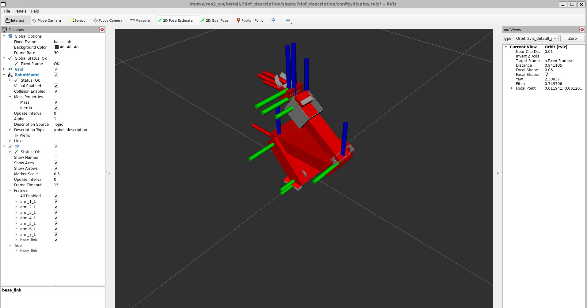
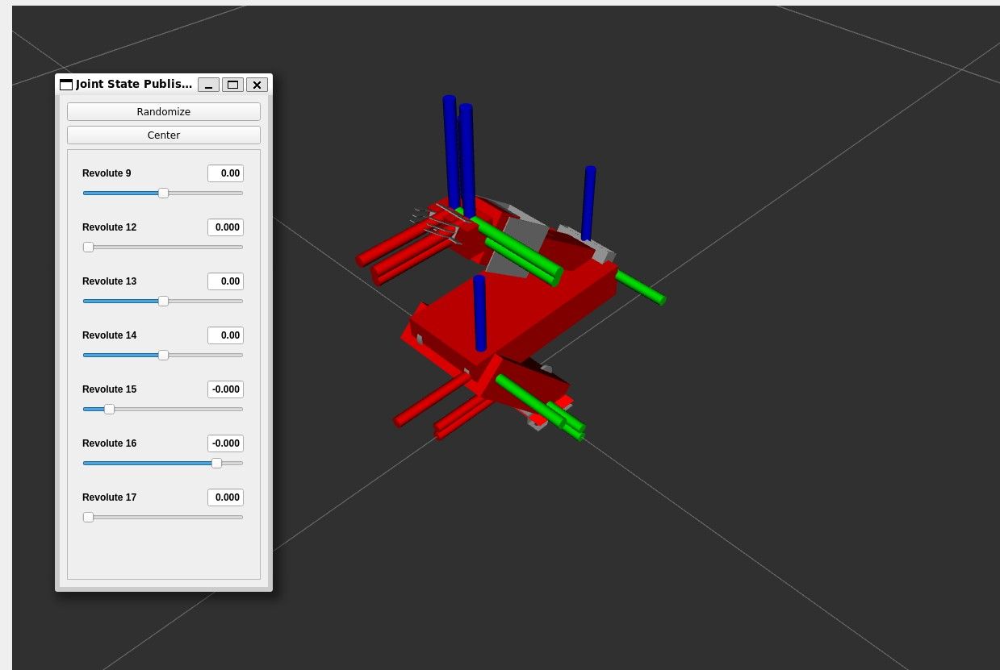

# 7dof_description — ROS 2 package

URDF/xacro description of the 7-DOF robotic arm used in this project, exported from the
Fusion 360 CAD assembly for visualization in RViz2 and simulation in Gazebo.

This package models the same arm covered in:

> T. R. Sahed, S. R. Islam, M. T. I. Aronno, M. S. R. Chowdhury, "Object Classification by a
> 7-DOF Robotic Arm Using MobileNet-SSD and Feedback Position Mapping," 2025 International
> Conference on Quantum Photonics, Artificial Intelligence, and Networking (QPAIN), Rangpur,
> Bangladesh. DOI: [10.1109/QPAIN66474.2025.11171666](https://doi.org/10.1109/QPAIN66474.2025.11171666)

- 3D design (Fusion 360): https://a360.co/46bxGCI
- Demo video: https://youtube.com/shorts/5LcHwnB7o1Q

The firmware and vision pipeline elsewhere in this repo drive the *physical* arm using
feedback position mapping (see the paper, Section III-D). This package is a separate
kinematic/visual model of the same geometry — useful for visualizing joint motion, planning,
or simulation, and not yet wired to the live hardware control loop.

## Contents

| Path | What it is |
|---|---|
| `urdf/7dof.xacro` | Main robot description (links, joints, visuals, collisions) |
| `urdf/7dof.trans` | Joint transmission definitions |
| `urdf/7dof.gazebo` | Gazebo-specific tags (materials, plugins) |
| `urdf/materials.xacro` | Link color/material definitions |
| `meshes/base_link.stl`, `meshes/arm_1_1.stl` … `arm_7_1.stl` | Per-link geometry, exported from Fusion 360 |
| `launch/display.launch.py` | `robot_state_publisher` + `joint_state_publisher_gui` + RViz2 |
| `launch/gazebo.launch.py` | Spawns the robot in Gazebo (classic) via `gazebo_ros` |
| `config/display.rviz` | Saved RViz view/display config used by `display.launch.py` |
| `config/gazebo.rviz` | Saved RViz config for the Gazebo view |
| `config/ros_gz_bridge_gazebo.yaml` | Topic bridge config for `ros_gz` (Gazebo Sim) |
| `package.xml`, `setup.py`, `setup.cfg`, `resource/` | Standard `ament_python` package files |
| `test/` | Boilerplate lint/style tests (`ament_lint_auto`) |

## Requirements

ROS 2 Humble (Ubuntu 22.04). Should work on other ROS 2 distros with minor tweaks.

```bash
sudo apt install ros-humble-xacro ros-humble-rviz2 ros-humble-robot-state-publisher \
  ros-humble-joint-state-publisher ros-humble-joint-state-publisher-gui \
  ros-humble-gazebo-ros-pkgs
```

## Build

Drop this package into the `src/` of a colcon workspace:

```bash
mkdir -p ~/ros2_ws/src
cp -r 7dof_description ~/ros2_ws/src/
cd ~/ros2_ws
colcon build --packages-select 7dof_description
source install/setup.bash
```

## Run

**RViz visualization** — spawns a GUI with sliders for every joint so you can pose the arm by hand:

```bash
ros2 launch 7dof_description display.launch.py
```

**Gazebo physics simulation**:

```bash
ros2 launch 7dof_description gazebo.launch.py
```

## Preview




## Notes

- `display.launch.py` defaults to `joint_state_publisher_gui` (slider window). Pass
  `gui:=false` to instead publish zeroed joint states without the GUI.
- The xacro is processed at launch time (`xacro.process_file(...)`), so editing
  `urdf/7dof.xacro` doesn't require a rebuild — just re-launch.
